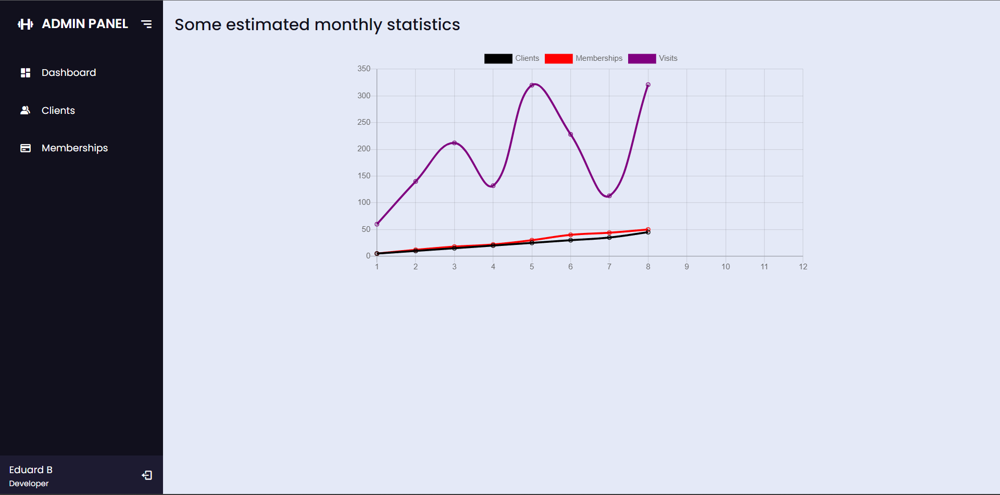
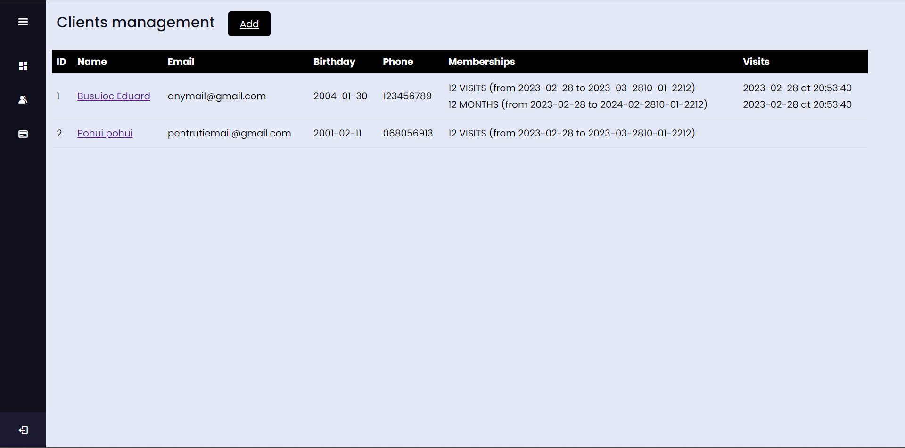
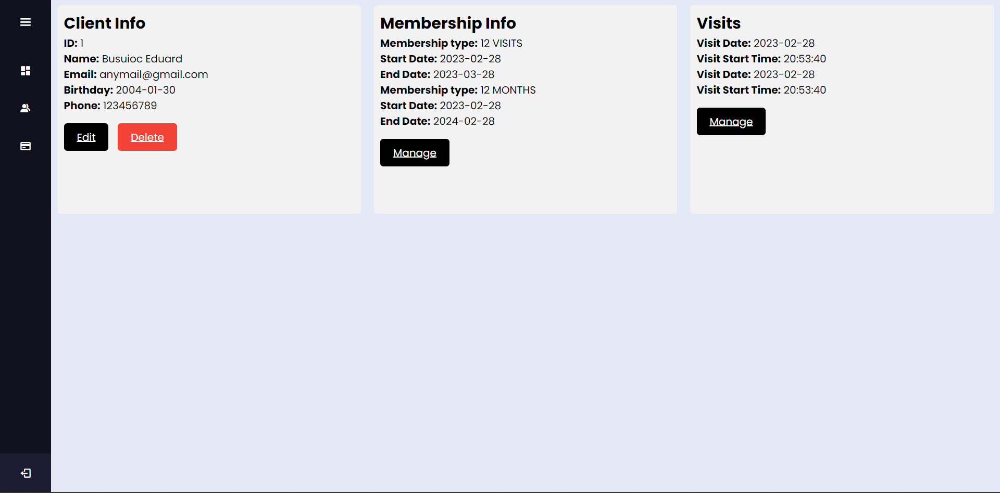
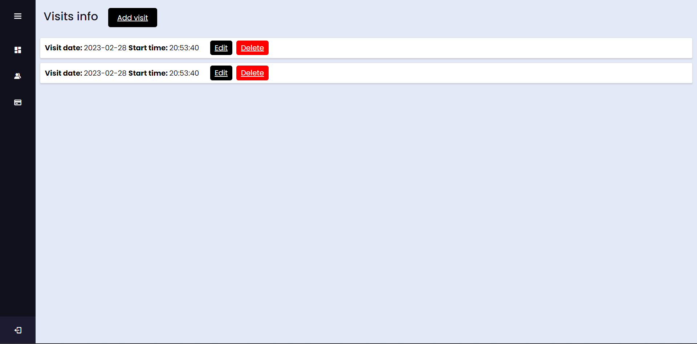
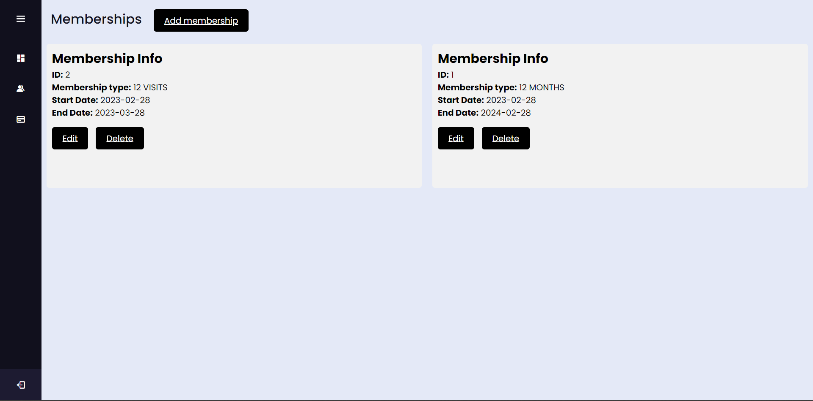
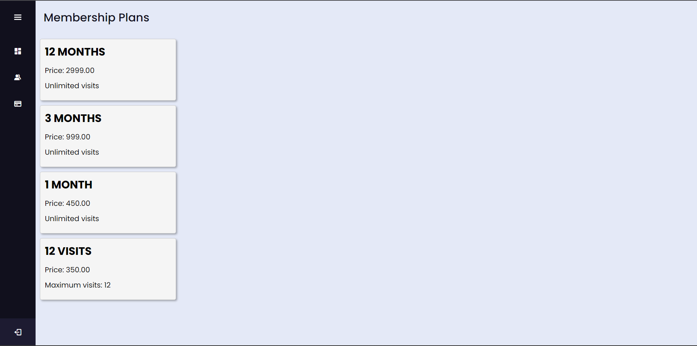
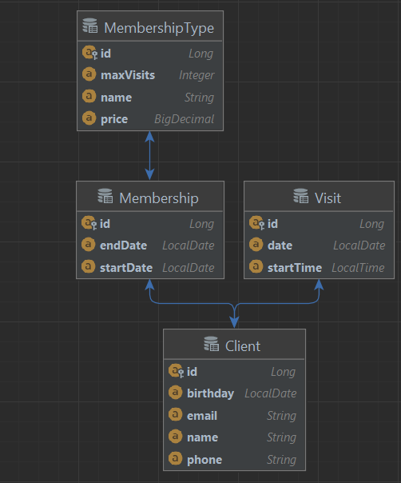

# Gym Management App
This is a Web App for a gym management system, divided in 2 submodules: API and WEB side. Developed using the Spring framework.

## Requirements
- Java 19
- Maven 3.6.3 or later

## Getting started
1. Clone the repository to your local machine
```bash
$ git clone https://github.com/kennshii/gym-management.git
```
2. Compile and run the project using Maven
```bash
$ mvn clean install
$ cd gym-management-web 
$ mvn spring-boot:run
```

- The API will be available at http://localhost:8080/
- Front end part will be available at http://localhost:8080/menu

## Web interface
- Main page

- Clients page

- Client info

- Client visits

- Client memberships

- Membership plans page



# REST API DESCRIPTION
## Entity relationship diagram


## ENDPOINTS
- ClientFullController

| Method | Endpoint                       | Description                                      |
|--------|--------------------------------|--------------------------------------------------|
| GET    | /api/v1/clientsFull            | Retrieve a list of all clients with full details |
| GET    | /api/v1/clientsFull/{clientId} | Retrieve a client with full details by its id    |

- ClientController

| Method | Endpoint                   | Description                         |
|--------|----------------------------|-------------------------------------|
| GET    | /api/v1/clients            | Retrieve a list of all clients      |
| GET    | /api/v1/clients/{id}       | Retrieve a client by its id         |
| POST   | /api/v1/clients            | Create a new client                 |
| PUT    | /api/v1/clients/{clientId} | Update a client by its id           |
| PATCH  | /api/v1/clients/{id}       | Partially update a client by its id |
| DELETE | /api/v1/clients/{id}       | Delete a client by its id           |

- MembershipController

| HTTP Method | URL                                                   | Description                                                            |
|-------------|-------------------------------------------------------|------------------------------------------------------------------------|
| GET         | /api/v1/memberships                                   | Get all memberships                                                    |
| GET         | /api/v1/memberships/{id}                              | Get a membership by its id                                             |
| POST        | /api/v1/clients/{clientId}/memberships                | Create a new membership for a client with id clientId                  |
| PUT         | /api/v1/clients/{clientId}/memberships/{membershipId} | Update a membership with id membershipId for a client with id clientId |
| DELETE      | /api/v1/clients/{clientId}/memberships/{membershipId} | Delete a membership with id membershipId for a client with id clientId |

- VisitController

| HTTP Method | URI                                                                     | Description            |
|-------------|-------------------------------------------------------------------------|------------------------|
| GET         | /api/v1/visits                                                          | Retrieve all visits    |
| GET         | /api/v1/visits/{visitId}                                                | Retrieve a visit by ID |
| POST        | /api/v1/clients/{clientId}/visits                                       | Create a new visit     |
| PUT         | /api/v1/clients/{clientId}/visits/{visitId}                             | Update a visit         |
| DELETE      | /api/v1/visits/{visitId} or /api/v1/clients/{clientId}/visits/{visitId} | Delete a visit by ID   |
